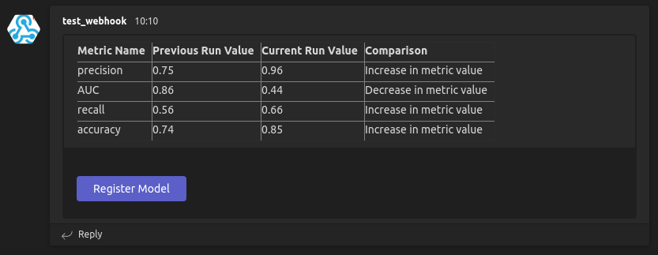

# Azure KPI Metrics

This repository contains a function to display Azure Machine Learning job/run metrics onto a Microsoft Teams Channel and to register any job/run as a model in Azure ML. Below depicts the workflow of the entire process.


Table of Contents
====
+ [Prerequisites](#prerequisites)
    + [Create Incoming Webhook](#create-incoming-webhook)
    + [Getting Experiment name from Azure Machine Learning](#getting-experiment-name-from-azure-machine-learning)
+ [Installation](#installation)
+ [Usage](#usage)


Prerequisites
===

## **Create Incoming Webhook**
-----------------------


**Source:** [Creating Incoming Webhook for Teams Channel](https://learn.microsoft.com/en-us/microsoftteams/platform/webhooks-and-connectors/how-to/add-incoming-webhook?tabs=dotnet)

### To add an Incoming Webhook to a Teams channel, follow these steps:


### 1. Open the channel in which you want to add the webhook and select ••• from the upper-right corner.
<p></p>

### 2. Select Connectors from the dropdown menu.
<p></p>


### 3. Search for Incoming Webhook and select Add.
<p></p>

### 4. Select Configure, provide a name, and upload an image for your webhook if necessary.
<p></p>


### 5. Copy and save the unique webhook URL present in the dialog. The URL maps to the channel and you can use it to send information to Teams.
<p></p>

### 6. Select Done.
<p></p>


<p></p>

The **Incoming Webhook** is now available in the **Teams channel**.


## **Getting Experiment name from Azure Machine Learning**
---

Save the name of your Azure ML *Experiment* in a variable. 


Installation
===

### 1. Clone the repository in the same directory as your Azure ML notebook/script
```sh
git clone https://sourcecode.socialcoding.bosch.com/scm/~tiy2kor/azure_kpi_metrics.git
```

### 2. Navigate to the *azure_kpi_metrics* folder
```sh
cd azure_kpi_metrics
```

### 3. Install the required Python libraries
```sh 
pip install -r requirements.txt
```

Usage
===

## **Execution of *azure_kpi_metrics* function in the `sample_classification.ipynb` notebook**
<p></p>

### **Prerequisites:**

Refer to the [Azure Machine Learning documentation](https://learn.microsoft.com/en-us/azure/machine-learning/?view=azureml-api-2) to:

+ [Manage subscription](https://portal.azure.com/)
+ [Create a workspace](https://learn.microsoft.com/en-us/azure/machine-learning/quickstart-create-resources?view=azureml-api-2)
+ [Create a compute instance](https://learn.microsoft.com/en-us/azure/machine-learning/quickstart-create-resources?view=azureml-api-2#create-a-compute-instance)

Navigate to the `sample_classification.ipynb` notebook in the repository and execute the cells as instructed.

**Important: Ensure your compute instance is stopped after running the notebook**

## **Execution of *azure_kpi_metrics* function as a standalone function in a Python script/notebook**
<p></p>

### 1. Import the `azure_kpi_metrics` function from `azure_kpi_metrics.py` file into your notebook/script

```python
from azure_kpi_metrics import *
```

### 2. Set Incoming Webhook URL and Experiment Name
```python
experiment_name = "<EXPERIMENT_NAME>"
teams_incoming_webhook_url = "<INCOMING_WEBHOOK_URL>"
```

### 3. Call the `azure_kpi_metrics` function

``` python
azure_kpi_metrics(experiment_name, teams_incoming_webhook_url)
```
<br />

## **Viewing job/run metrics in Teams Channel and registering job/run as a Azure ML model**
<p></p>

### 1. Navigate to your Teams channel to view the job/run metrics



The metrics should appear as shown in the above screenshot.
<p></p>

### 2. To register model, click the *Register Model* button

This opens up the Jobs page on Azure Machine Learning to manually register the model.
<p>

**Important: Users must be in the same workspace as the job/run in order to register the model.**


